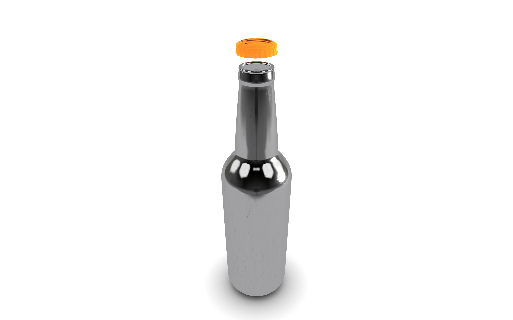

# Hello Journal
For this project the idea is to make a product visualizer about bottles.
The main idea is that the visualizer could help an imaginary wine producer, or general beverage producer, to select the right
type of bottle that will contain his product.

For this project I would like to use ReactJS in combination with THREEJS to control the state of the configurator and the many different typologies of materials and objects that the configurator could present to the customer.

These days I've tried different solutions to get the project organized and structured in a way that appleased me.
In particular I've found a [starter pack](https://github.com/edwinwebb/three-seed) with webpack, npm and other configurations that supported my needs.

I'm going to explain the organization of the project with a commit for each part and an update in the journal to document the process.

The project came with a standard `package.json` to download all the dependencies required for the project to work. Since it includes webpack to load resources, there is also a `webpack.config.js` file.

The `main.js` file is the starting point of all the the project. There is not the need for an index since we treat this project with modules.

I've structured the objects in a separate folder. Each object has an associated model inside an `.obj` file loaded through his class. These objects are imported then in a general object *ConfiguratorScene* that contains all the lights, products and so on.
The *ConfiguratorScene* is the root group of the scene.

The objects should have a material, in particular these materials and their textures (using the metallic workflow) are stored in separate subfolders inside the root folder `materials`. Then for each material there is a specific class that loads the textures and create an instance of a material with the specified textures.

The material to be able to reflect the light and show their properties specified through textures (for instance the roughness) need to have an associated *environment map*. This environment map is created through a CubeMap that I've generated through an online tool. The image divided in cubes is a studio environment found in google images.

To reproduce an ambient occlusion of the bottle projected on the plane I've imported the .obj model inside blender and followed a tutorial for the creation of an ambient occlusion texture with a perpendicular ambient light. This texture then is applied to the plane to reproduce the effect of the shadow casting of the bottle.

Now the scene looks like a photo booth similar to the [calligaris store](https://www.calligaris.com/en_int/shop/annie-cs-1853-lh.html) from which I've taken the inspiration for my own configurator.

We can see an image of the visualizer at this moment below:

It's time to implement the ReactJS GUI!

First progress of the GUI. It's implemented in ReactJS and will change the materials accoriding to the settings selected by the user.