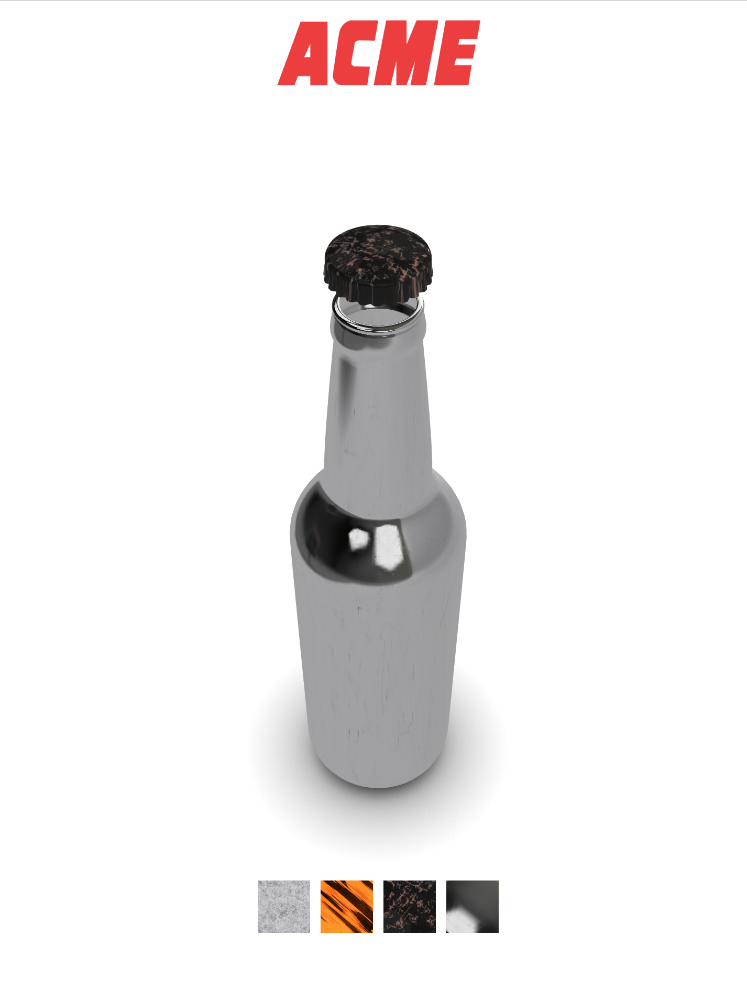

# ACME Product Visualizer

This is a simple product visualizer that aims to present to an imaginary customer a set of different types of bottle caps to choose from.
These caps differ by their material, so the customer can choose which one he prefers to buy.

## Configuration description

This configurator is made with different technologies:
- Three.js
- ReactJS
- Webpack
- Node modules
- Babel for es6 capabilities

To install this project is required to have installed a version of `node.js`.
If this is verified the next step is to clone the repository and then run the command

```
npm install
```

Once the installation is complete the command to start the web server is 

```
npm start
````

This command spins up a web server configured with webpack that has *autoreload* capabilities.

## Process
I started this project with the main idea to let an user to change materials to different bottle models.
In the end this project just enable users to change materials to bottlecaps.

I selected the model, a free downloadable one, from the online library Sketchfab. Then since I wanted to be able to manipulate both the glass bottle and the bottle cap, I divided them inside Blender.

Blender played a role also during the creation of the ambient occlusion map of the plane on which the bottle is positioned.

The environment map is created thanks to an online [generator](https://jonaszeitler.se/cubemap-toastmap-generator/) of cube maps. I've found the image through google images.

The textures for the materials have been downloaded from different online libraries such as [freepbr](https://freepbr.com/c/base-metals/), [poliigon](https://www.poliigon.com/search?is_free=true), [allegorithmic](https://source.allegorithmic.com/assets).

After the gathering of all the materials/textures/assets, I started the implementation of the whole scene that is organized with separate files structured in different classes thanks to es6.
The structure I gave to the codebase allow to make changes with lower effort, augmenting the separation of the responsibilities.
Implementing and adding new materials is easy and just require the setup of a small area of the application.
With more time it could have been better, but the ground for improvement is well prepared.

The GUI is easy aswell. There are just few icons to change the materials in the bottom of the screen. These are intuitively clickable by the users.
The GUI is implemented with a ReactJS component that has a state with a reference to the instance of the main scene. Thanks to this we can send messages to the THREEJS instance of the scene through user events in the interface. Thse events are then mapped to reflect the interactions with the rispective effect in the scene, in this case a change in the material of the bottle cap.

I've not implemented new shaders, I've used the shaders of `MeshStandardMaterial`, but at the time I have not been able to retrieve all the details of the BRDF equation and rendering one.
I've read the paper related to the approach by [disney](https://disney-animation.s3.amazonaws.com/library/s2012_pbs_disney_brdf_notes_v2.pdf) referenced in the THREEJS documentation, but the codebase of the shaders isn't completely understandable for me due to lak of knowledge of glsl complex programs.

# Screenshots

