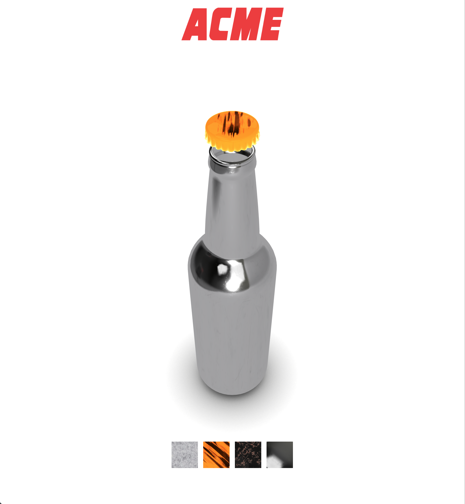

# ACME Product Visualizer

This is a simple product visualizer that aims to present to an imaginary customer a set of different types of bottle caps to choose from.
These caps differ by their material, so the customer can choose which one he prefers to buy.

## Configuration description

This configurator is made with different technologies:
- Three.js
- ReactJS
- Webpack
- Node modules
- Babel for es6 capabilities

To install this project is required to have installed a version of `node.js`.
If this is verified the next step is to clone the repository and then run the command

```
npm install
```

Once the installation is complete the command to start the web server is 

```
npm start
````

This command spins up a web server configured with webpack that has *autoreload* capabilities.

## Process
I started this project with the main idea to let an user to change materials to different bottle models.
In the end this project just enable users to change materials to bottlecaps.

I selected the model, a free downloadable one, from the online library Sketchfab. Then since I wanted to be able to manipulate both the glass bottle and the bottle cap, I divided them inside Blender.

Blender played a role also during the creation of the ambient occlusion map of the plane on which the bottle is positioned.

The environment map is created thanks to an online creator of cube maps (https://jonaszeitler.se/cubemap-toastmap-generator/).